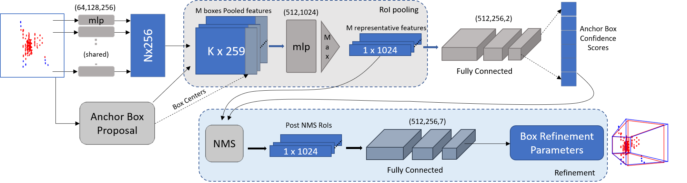

# RP-net: 3D bounding box estimation from multi-radar point clouds

This is the official code release for RP-net. It is the deep-learning system of pointillism which estimates 3D bounding boxes from Cross-Poential point clouds generated by [pointillism](https://wcsng.ucsd.edu/pointillism/)

## Architecture




## Dataset
Download the dataset from [DATASET](https://drive.google.com/file/d/1C-Ryh5W5FLPenNgPUDNcNwiac-NnwU1A/view?usp=sharing) into the data folder. It should follow the structure as shown below.

About `300` frames are provided from each sensor for `48` different scenes. Each frame is time synchronized among all the sensors using system timestamps. 

    ```
    pointillism
    └───data
        └───scene{#}       'Where {} is omitted and # is the folder number'
            └───lidar
                └───*.pcd
            └───radar_0
                └───*.csv
            └───radar_1
                └───*.csv
            └───images
                └───*.jpg
            └───label
                └───*.json
    ```

## Data Preparation
1. Clone this repository and enter the **pointillism_rp_net** directory.
2. Make sure that the data is downloaded to this directory.
3. Run ``` python3 data_generator.py```. This generates the input point clouds and labels required for training the model It will create a folder **input_files**, where the generated npy files will be saved.

## Docker File
We have provided a dockerfile to ease code sharing. The docker is based on 
- CUDA 10.1
- pytorch 1.4

## Build and Run Docker Image

Build and run the docker image by running this command:
```
./run_docker.sh
```

## Comet ML
Create an account on [comet.ml](https://www.comet.com) in order to monitor performance metrics as the model is training. In the file **LLP-net.py**, on line 190, enter the API key, project name, and workspace corresponding to the comet account. The API key can be found in Settings -> Developer Information.

## Training RP-net
1. Make sure you are in the **pointillism** directory.
1. (Not required with docker) Run ```./build_and_install.sh```. This installs the necessary libraries required for training. 
2. Run ```python3 RP-net.py``` to start training the model.

It is recommended to train the model for at least **200** epochs to achieve the best results.

## Interpreting the Results
The performance metrics are three MAP values and loss values. The three MAP values correspond to IoU thresholds of 0.5, 0.1, and 0.01. 

## Citation 

```
@inproceedings{bansal2020pointillism,
  title={Pointillism: accurate 3D bounding box estimation with multi-radars},
  author={Bansal, Kshitiz and Rungta, Keshav and Zhu, Siyuan and Bharadia, Dinesh},
  booktitle={Proceedings of the 18th Conference on Embedded Networked Sensor Systems},
  pages={340--353},
  year={2020}
}
```
